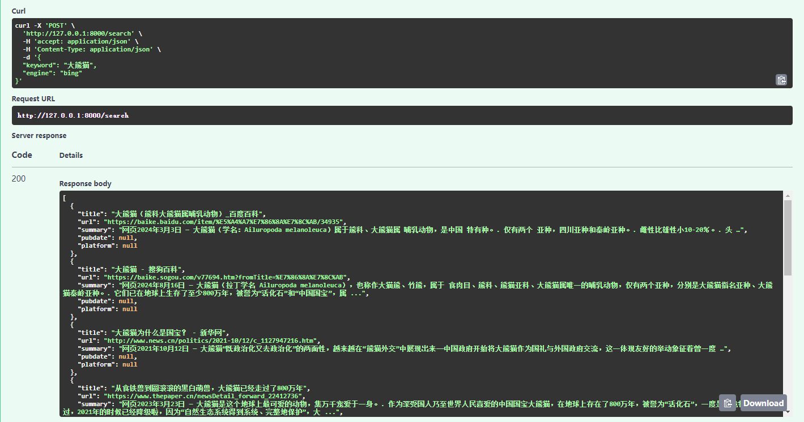

### 介绍

本项目整合playwright和httpx进行网页抓取，通过复用playwright的cookies给httpx来进行加速。

内容解析基于html2text和readability-lxml。

项目定位主要是用于给LLM提供搜索和网页内容接口，而非传统的爬虫框架。


**欢迎大家提供建议或提交代码**。

已实现功能如下：
+ 浏览器环境补全, 抵御爬虫检测
+ 搜索
  - ~~必应~~, *sc参数还有问题*
  - 头条
+ 网页抓取
  - html
  - title
  - text
  - metadata
  - links
  - markdown
  - main_content
+ 网页截图
+ html抽取

### 快速开始

```bash
docker run -d -p 80:80 xuxianren94/ccbot:latest
```

### 部署
#### 本地
```bash
git clone --depth 1 https://github.com/xuxianren/ccbot.git
conda create -n ccbot python=3.12
conda activate ccbot
cd ccbot
pip install -r requirements.txt
playwright install chromium && playwright install-deps chromium

uvicorn ccbot.app:app
```

#### docker
**构建**
1. chrominum的下载需要访问外网，修改下面代理地址
2. dockerfile中pip使用了腾讯的镜像源，可以视情况修改

```bash
docker build . --build-arg "HTTP_PROXY=xxx" --build-arg "HTTPS_PROXY=xxx" --build-arg "NO_PROXY=localhost,127.0.0.1,.example.com" -t ccbot:latest
docker run -d --name ccbot -p 80:80 ccbot:latest
```

**使用**
```bash
docker run -d -p 80:80 xuxianren94/ccbot:latest 
```

### 使用
部署完成后打开http://127.0.0.1:8000/docs查看文档和调试

#### 搜索
当前支持必应和头条搜索


#### 网页抓取
内置了常用的提取方式, 有额外提取需求, 可以只返回html, 之后在客户端进行解析

- main_content是网页正文内容, 在新闻类网页上工作较好, 有些网页会提取不完整
- markdown是html2text转换的全部内容


#### 网页截图
主要用于debug和浏览器环境补全检测


### 主要流程


